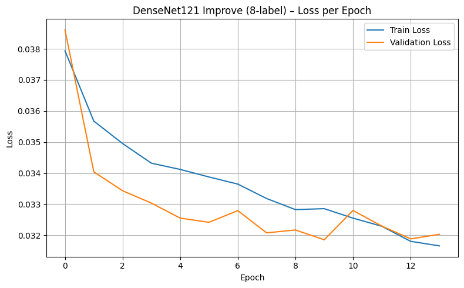
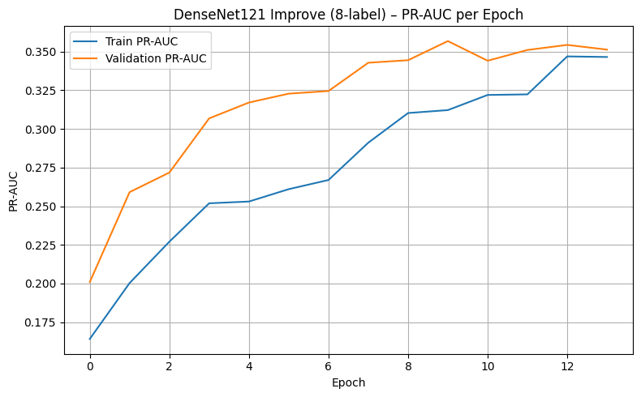
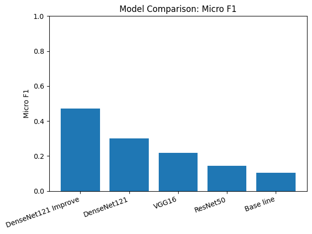
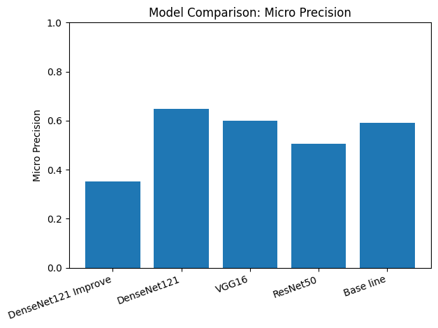
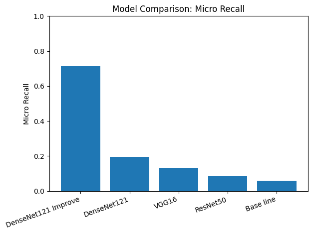
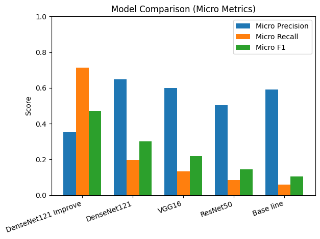
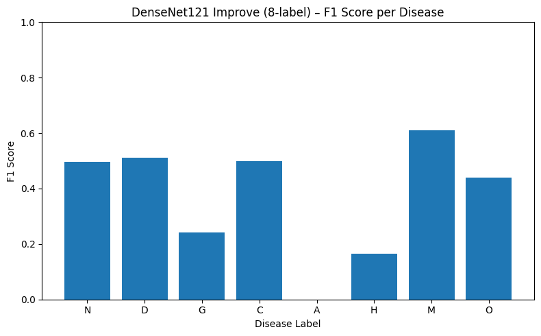
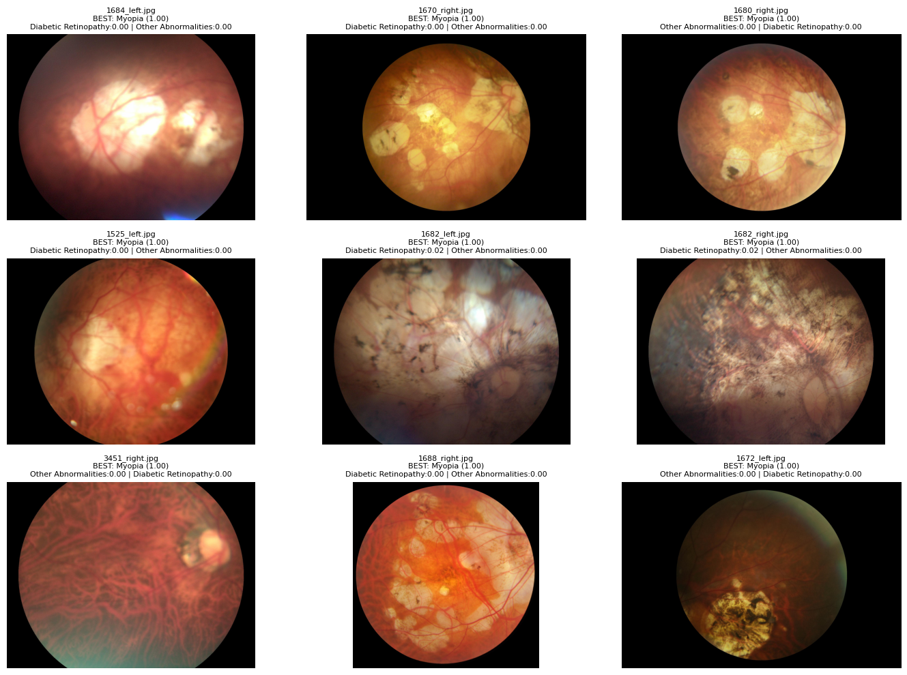

# Multi-Label Retinal Disease Classification using Deep Learning (ODIR-5K)

## _Abstract_
<p align="justify">
Vision, the most dominant of our senses has a critical role in our lives. According to the World Health Organization (WHO), globally, eye conditions which can cause blindness or vision loss such as cataracts, diabetic retinopathy, glaucoma, and age-related macular degeneration. These conditions often progress slowly and may go undetected until vision loss occurs. Early and accurate diagnosis is important to slow disease progression, protect remaining vision and improve the quality of life of those affected. 
Deep learning is a branch of machine learning field in which models learn complex patterns from large amounts of data. Using multi-layer neural networks, deep learning methods can find non-linear and hierarchical patterns, which makes it useful for analyzing and recognizing tasks.
 Among the various deep learning architectures, Convolutional Neural Networks (CNNs) have emerged as a dominant framework, particularly in tasks involving image and spatial data (Virginia et al., 2025). CNNs also have become the dominant architecture for image-based medical diagnosis. CNNs are specifically designed to process visual data through convolutional and pooling layers, allowing the model to automatically learn hierarchical visual features from low-level edges to high-level related patterns.
In the real world clinical datasets, ocular disease datasets commonly face multi-label characteristics and highly imbalanced class distributions, where certain diseases appear far less frequently than others. These can reduce the effectiveness of conventional CNN models and evaluation strategies that rely solely on accuracy. This project applies transfer learning based CNN architectures for multi-label ocular disease classification by using retinal fundus images while also compares the performance of multiple CNN architectures to identify the most suitable model for multi-label ocular disease classification. Specifically, the CNN architectures VGG16, ResNet50, and DenseNet121 are utilized due to their proven effectiveness in medical image classification.
</p>

**Keywords:** Deep Learning, Convolutional Neural Networks, Image Classification, Ocular disease

---
## 1. Problem Definition
This project addresses the problem of **multi-label retinal disease classification** from fundus images.
Unlike multi-class classification, a single retinal image may contain **multiple co-existing diseases**, therefore the task is formulated as a **multi-label classification problem**.

The model outputs independent probabilities for each disease using a sigmoid activation function, enabling the prediction of more than one condition per image.

**Disease Labels (8):**
- N: Normal
- D: Diabetic Retinopathy
- G: Glaucoma
- C: Cataract
- A: Age-related Macular Degeneration
- H: Hypertension
- M: Myopia
- O: Other abnormalities

---

## 2. Dataset and Preprocessing
- **Dataset:** ODIR-5K (Ocular Disease Intelligent Recognition)
- **Source:** Kaggle
- **Split:** Train / Validation = 80 / 20
- **Input Size:** 224 × 224 RGB images

### Preprocessing Steps
- Resize images to 224×224
- Normalize pixel values to [0,1]
- Data augmentation is applied **only to the training set**
- Validation data is kept unchanged for unbiased evaluation

### Dataset Download
Download ODIR-5K from Kaggle:
https://www.kaggle.com/datasets/andrewmvd/ocular-disease-recognition-odir5k

> Note: The dataset is not included in this repository due to size and licensing constraints.  
> Users should download the dataset separately and update the data paths accordingly.

---

## 3. Model Architectures and Rationale
The following models are evaluated:

- **Baseline CNN (from scratch)**  
  A simple convolutional neural network trained without pre-trained weights, used as a reference floor model.

- **VGG16 (Transfer Learning)**  
  Used as a baseline among pre-trained CNN architectures due to its simple and well-known structure.

- **ResNet50 (Transfer Learning)**  
  Incorporates residual connections to improve gradient flow in deeper networks.

- **DenseNet121 (Improved Model)**  
  Employs dense connections that enable feature reuse and improved representation learning, particularly beneficial for medical images.

### Improved Training Strategy (DenseNet121 Improve)
- Focal Loss to address class imbalance
- PR-AUC as a monitoring metric
- Decision threshold optimization for multi-label prediction

---

## 4. How to Run the Project
This project is designed to be executed using **Google Colab**.

### A. Environment Setup

Most required libraries (TensorFlow, NumPy, Pandas, Scikit-learn) are pre-installed in Google Colab.  
If additional dependencies are needed, they can be installed using:

```bash
pip install -r requirements.txt
```

### B. Running the Experiments
To run the project:
1. Open the notebook `notebooks/deep_learning_cnn_retinal_disease.ipynb` in Google Colab. 
2. Upload or mount your dataset (e.g., via Google Drive).
3. Ensure that the file paths match the dataset structure.
4. Run cells in order:
  - Data loading and preprocessing
  - Baseline and transfer learning model training
  - Evaluation and metric computation
  - Threshold optimization and final comparisons

The notebook contains all steps from data preparation to evaluation.

---

## 5. Result
### Training Curves (DenseNet121 Improve)




### Model Comparison (Micro metrics)









### Per-label F1 (DenseNet121 Improve)


## Sample Predictions (DenseNet121 Improve)
Below are example inference results generated by the best model:



---

## 6. Evaluation Summary
<p align="justify">
The DenseNet121 Improve model with the improved training strategy achieved the highest overall Micro F1 score among all evaluated models, indicating a strong balance between precision and recall on the multi-label validation dataset. Some disease labels, such as AMD (A) and Glaucoma (G), had lower F1 scores, likely due to class imbalance and visual similarity with other conditions. Despite this, the DenseNet121 Improve model showed reliable performance in identifying common disease patterns. This section provides an overview of the model comparison results and highlights important performance observations.
</p>
